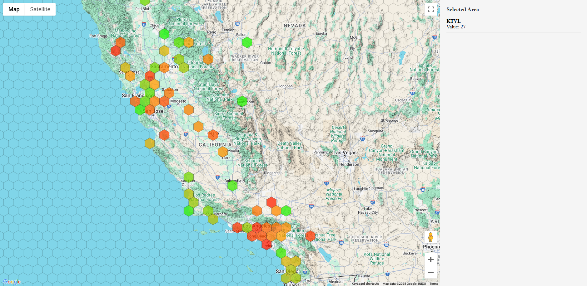

# Hexmap - Google Map Hexmap

This is a variation of joshcarr's Google Maps + D3 + hexbin project. 

https://gist.github.com/joshcarr/c0a405243d3051a9c986



## Updates

There are a number of major/minor differences to Josh's excellent version. 

1. Hex grid extends out a bit
2. Zoom In/Zoom Out
3. stations.json simplification
4. Mouse over example
5. Secure API key handling

## Data Format: stations.json

The `stations.json` file contains location data that will be visualized on the map. It uses a simple key-value structure where:

- Each entry has an airport code as its key (e.g., "KMAE", "KSFO")
- Each value is an array with the following structure:
  - `[0]`: Longitude (decimal degrees, negative for west)
  - `[1]`: Latitude (decimal degrees, positive for north)
  - `[2]`: Location name (string)
  - `[3]`: Array containing a numeric value used for color intensity (e.g., `[26]`)

### Example Entry:
```json
"KMAE": [-120.12, 36.98, "MADERA MUNICIPAL AIRPORT", [26]]
```

### Customizing the Data

To use your own data:

1. **Basic Structure**: Maintain the JSON object format with unique keys for each location
2. **Coordinates**: Ensure accurate longitude (index 0) and latitude (index 1) values
3. **Names**: Provide descriptive names at index 2
4. **Value**: The numeric value at index 3 is used for coloring the hexagons (higher numbers = more orange, lower = more green)

### Sample Custom Entry:
```json
{
  "LOCATION1": [-122.45, 37.76, "CUSTOM LOCATION 1", [15]],
  "LOCATION2": [-118.24, 34.05, "CUSTOM LOCATION 2", [30]]
}
```

### Notes:
- Values in the 4th element array (`[26]`, `[15]`, etc.) determine hexagon coloring on the map
- The scale ranges from green (lower values) to orange (higher values)
- You can modify the coloring scale in the `index.html` file (look for `cscale`)

## Setup Instructions

### Google Maps API Setup

1. Create a Google Cloud project and enable the Maps JavaScript API
2. Create an API key with appropriate restrictions:
   - HTTP referrer restrictions (limit to your domains)
   - API restrictions (limit to Maps JavaScript API)

### Project Configuration

1. Copy `config.json.example` to `config.json`
2. Add your Google Maps API key to `config.json`
3. Make sure `config.json` is in your `.gitignore` to prevent exposing your API key

```json
{
  "googleMapsApiKey": "YOUR_API_KEY_HERE"
}
```

### Running the Project

Open `index.html` in your browser or serve it using a local web server.

## Customizing the Visualization

### Modifying the Color Scale

The color scale for hexagons is defined in the `index.html` file. To change it, find this section:

```javascript
const cscale = d3.scale.linear()
    .domain([0, 20])
    .range(["#00FF00", "#FFA500"]);
```

- `domain`: Sets the min and max values for your data (`[0, 20]`)
- `range`: Sets the colors to use (`["#00FF00", "#FFA500"]` - green to orange)

Adjust these values to match your data range or preferred colors.

### Changing Hexagon Size and Density

To modify the hexagon grid appearance:

1. Locate the `hexRadius` variable (default: 18)
2. Adjust the `paddingFactor` and `overlapFactor` variables to control grid density

This may or may not be a little tricky. So proceed with caution. 

### Adding More Data Visualizations

For more advanced customizations:
1. Enhance `updateInfoPanel()` to show additional data
2. Modify the click/hover interactions
3. Add additional overlays or visualizations by extending the D3 implementation

## Troubleshooting

- If hexagons don't appear, check your coordinates in `stations.json`
- For API key issues, verify your key restrictions in Google Cloud Console
- If colors aren't displaying correctly, check the numeric values in your data against the color scale domain