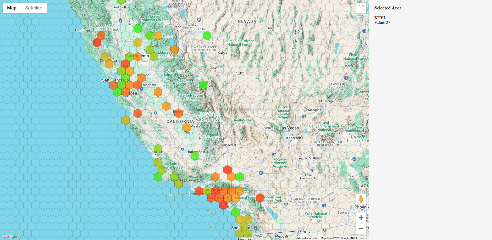

# Hexmap - Google Map Hexmap

This is a variation of joshcarr's Google Maps + D3 + hexbin project. 

https://gist.github.com/joshcarr/c0a405243d3051a9c986

hexmap.png

## Updates

There are a number of major/minor differences to Josh's excellent version. 

1. Hex grid extends out a bit
2. Zoom In/Zoom Out
3. stations.json simplification
4. Mouse over example

